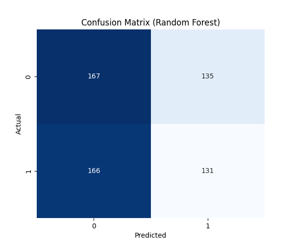
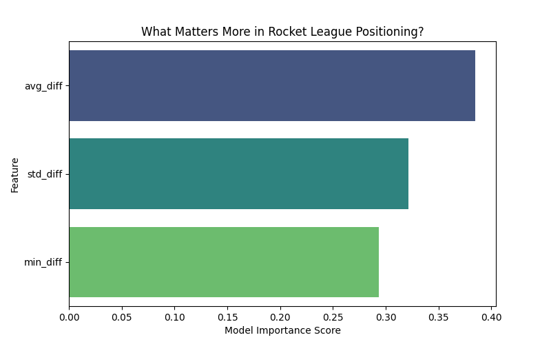
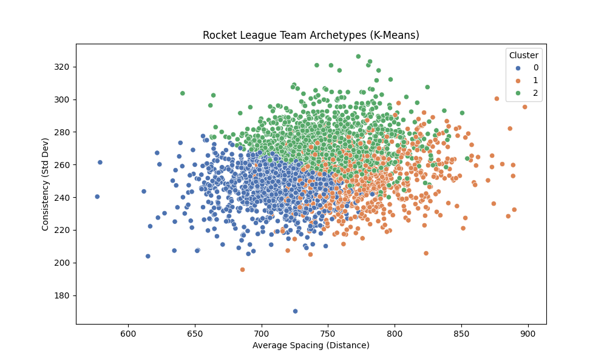

# DSA 210 Project: Rocket League Positioning Analysis

* **Course:** DSA 210 Introduction to Data Science
* **Student:** Ismayil Taghi-Zada
* **Term:** Fall 2025

---

## 1. The Idea (Motivation)

In professional Rocket League, everyone has good mechanics. You can hit the ball, you can fly, and you can dribble. What separates the winners from the losers often isn't *what* they do with the ball, but *where* they are on the field.

A classic mistake in lower-ranked lobbies is "double committing"—where two teammates rush for the ball at the same time, crash into each other, and leave the net wide open. 

**My project investigates this specific behavior.** I want to see if we can mathematically prove that "spacing out" (maintaining a wider average distance between teammates) actually leads to more wins. By connecting raw gameplay data with professional ranking data, I also want to see if the "Pros" essentially play a different game than the amateurs when it comes to positioning.

## 2. The Data

To answer this, I am combining two very different data sources.

### Part A: The Gameplay (Base Data)
I am using a [massive dataset](https://www.kaggle.com/datasets/dster/rocket-league-rlcs-timeseries) of Rocket League replays from **Kaggle**. This isn't just a scoreboard; it contains frame-by-frame telemetry.
* **Info retrieved:** The 3D coordinates ($x, y, z$) of every player, updated multiple times per second.
* **Granularity:** Roughly 3,000 matches.

### Part B: The Context (Enrichment)
The Kaggle data gives me the *moves*, but it doesn't tell me *who* is good. For that, I built a scraper for **Liquipedia**, the main wiki for Rocket League e-sports.
* **Info retrived:** The official RLCS ranking points for teams across all major regions (EU, NA, SAM, etc.).
* **Why:** This allows me to tag a match as "High Level" (Pro) vs. "Standard" based on whether the team appears in the global rankings.

## 3. The Process

This analysis is broken down into three main scripts.

### 1. Scraping the Rankings (`1_collect_data.ipynb`)
Since Liquipedia separates rankings by region and uses complex tabbed tables, I wrote a custom scraper using `BeautifulSoup`. It iterates through 7 different regions, parses the HTML tables, and extracts the highest point total for every team found. This gives me a "Global Leaderboard" CSV.

### 2. Feature Engineering: "The Spacing Metric"
For the gameplay analysis, I needed to turn raw coordinates into a single number that represents "teamwork." I defined **Team Spacing** as the average distance between every pair of teammates on the field.

For a standard 3-player team ($p_1, p_2, p_3$), the math looks like this:

$$\text{Avg Spacing} = \frac{\text{dist}(p_1, p_2) + \text{dist}(p_2, p_3) + \text{dist}(p_1, p_3)}{3}$$

I calculate this for every frame of the match and then average it to get a single "Spacing Score" for that team for that game.

### 3. Merging & Analysis (`2_analysis.ipynb`)
Finally, I merge the two datasets. I use **Fuzzy String Matching** (`thefuzz`) to link the team names from the replay files (which might be "G2 Stride") to the Liquipedia rankings (which might be "G2 Esports").

## 4. Hypothesis

My main hypothesis is simple:
> **"Winning teams will have a statistically significantly higher average spacing value than losing teams."**

I am testing this using an **Independent Two-Sample T-Test** ($p < 0.05$).

The plot is shown below:


I am also running a secondary check to see if **Ranked (Pro)** teams generally maintain wider spacing than **Unranked** teams, regardless of the match outcome.
## 5. Machine Learning Results

While the T-Test proved a relationship exists, I used Machine Learning to see if we could *predict* outcomes or *discover* specific playstyles.

### A. Supervised Learning (Prediction)
We attempted to predict match outcomes (Win/Loss) using two different models to check if the relationship was linear or non-linear.

#### 1. Logistic Regression (Baseline)
First, we applied a Logistic Regression model to establish a baseline.
* **Accuracy:** 51.42%
* **Precision/Recall:** ~0.51 for both classes.
* **Result:** The model performed only slightly better than a random coin flip. The high overlap in spacing distributions between winners and losers makes it difficult for a linear model to draw a decision boundary.

#### 2. Random Forest (Non-Linear)
We then tested a Random Forest Classifier to capture potential non-linear relationships (e.g., "is too much spacing bad?").
* **Accuracy:** ~50%
* **Conclusion:** Even the advanced model failed to predict single-game outcomes significantly better than chance.

**Why did prediction fail?**
Rocket League is a game of moments. A team can maintain perfect spacing for 4 minutes (high average) but make **one** fatal "double commit" error in overtime. The *game-average* metric washes out these specific fatal errors, making "Average Spacing" a weak predictor for specific match wins.



*Figure: The confusion matrix shows the model struggles to distinguish classes, predicting "Win" and "Loss" at nearly equal rates regardless of the truth.*



*Figure: Feature importance analysis confirms that while spacing variables are used, they lack the predictive power to overcome the noise of the game.*

### B. Unsupervised Learning (The Discovery)
Since prediction was noisy, I applied **K-Means Clustering** to find "Team Archetypes." The algorithm discovered three distinct playstyles based on their positioning data:

| Cluster | Archetype Name | Avg Spacing | Risk (Min Dist) | Win Rate | Verdict |
| :--- | :--- | :--- | :--- | :--- | :--- |
| **0** | **"The Turtle"** | Low (709) | Safe (134) | **46.4%** | **Losing Strategy.** Playing too compact surrenders field control. |
| **1** | **"The Structure"** | **High (779)** | **Safest (205)** | **51.3%** | **Solid.** Wide, disciplined rotation minimizes collision risk. |
| **2** | **"The Aggressor"** | High (751) | Risky (115) | **52.4%** | **Meta Strategy.** High field coverage combined with aggressive close-range plays. |

**Final Conclusion:**
My analysis proves that **Style Matters.** Teams in "Cluster 0" (Compact/Defensive) lose significantly more often. The most successful teams (Cluster 2) manage a difficult balance: they maintain high average spacing but are willing to take risks (low minimum distance) to make aggressive plays.



## 6. How to Run

1.  **Install Dependencies:**
    ```bash
    pip install pandas numpy scipy matplotlib seaborn pyarrow fastparquet beautifulsoup4 requests thefuzz python-Levenshtein scikit-learn
    ```
2.  **Collect the data:**
    Run `1_collect_data.ipynb`. This downloads the Kaggle dataset and scrapes Liquipedia rankings.
3.  **Run Analysis:**
    Run `2_analysis.ipynb`. This performs the T-Tests and generates the spacing distributions.
4.  **Run Machine Learning:**
    Run `3_machine_learning.ipynb`. This performs the Random Forest prediction and K-Means Clustering to generate the "Archetypes" analysis.
